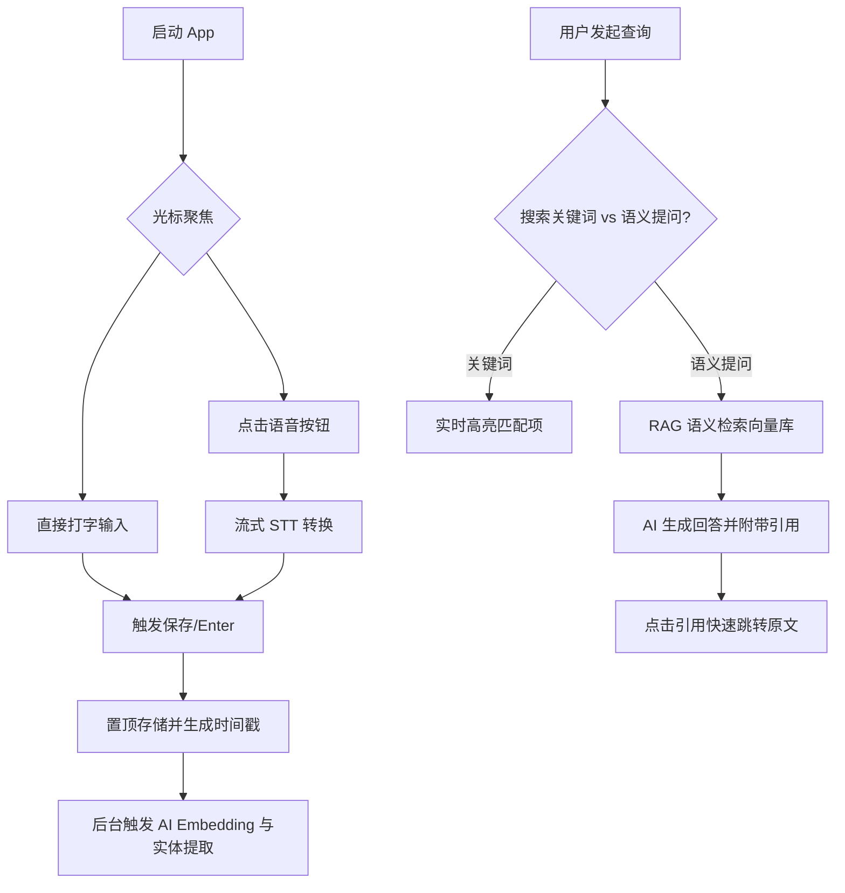

# Jot Diary 软件需求规格说明书 (PRD)

## 1. 产品定义与核心价值 (Vision)

### 1.1 产品名称
**Jot Diary**

### 1.2 产品定位
一个基于 **Append-Only（仅增）模式**、去除所有分类负担、由 AI 驱动检索与洞察的流式日记应用。

### 1.3 核心理念
**“记录应如呼吸般自然，整理交给 AI。”**
Jot Diary 旨在解决传统笔记应用中“分类焦虑”和“排版负担”的问题。用户只需关注当下的表达，所有信息的结构化和关联性由 AI 在后台自动完成。

---

## 2. 详细功能模块说明 (User Stories & Specs)

### 2.1 核心必备功能 (Core Essentials)
这些功能是产品的基石，确保“录入-存储-检索”闭环的极致简单。

*   **[F1] 极简输入界面 (Instant Input)**：
    *   **永远打开的输入框**：应用打开后，光标默认聚焦在输入框内，无需任何点击即可开始打字。
    *   **显型语音按钮**：界面提供一个非常显眼的麦克风按钮，点击即进入语音转文字（STT）模式，自动将识别文本追加至文档。
*   **[F2] Append-Only 存储模式**：
    *   **自动顶部追加 (Reverse Chronological)**：新内容始终出现在文档顶部，符合“关注当下、回溯历史”的记忆习惯。
    *   **纯文本约束**：禁止粗体、斜体、颜色等复杂排版。仅支持换行。
*   **[F3] 单一文件管理 (Single Infinite Document)**：
    *   **唯一文档**：用户无需新建文件、无需选择日期。所有记录存在于唯一的无限流文档中。
    *   **自动时间戳**：每条记录前自动生成格式如 `[2026-01-04 10:30]` 的时间戳。用户可配置是否开启，但默认启用以支持精准检索。
*   **[F4] 强大全文检索 (Power Search)**：
    *   **即时搜索与高亮**：输入关键词后，结果实时高亮并支持快速跳转至具体位置。这是替代“分类整理”的核心手段。

### 2.2 增强型功能 (Enhanced Experience)
提升应用的可靠性、跨平台能力及数据安全性。

*   **[F5] 多平台同步**：支持 iOS/Android/Web/Desktop 跨端实时同步，确保随时随地记录。
*   **[F6] 数据自由导出**：支持一键导出为 `.txt` 或 `.md` 格式。用户对自己的数据拥有绝对控制权，不被产品绑定。
*   **[F7] 离线优先 (Offline-First)**：离线状态下可正常记录与搜索，恢复网络后自动同步增量内容。
*   **[F8] 自动化备份**：支持设置每日/每周自动备份完整文档至关联邮箱或第三方云存储（如 Google Drive）。

### 2.3 AI 集成功能 (AI Intelligence)
产品的核心竞争力，将杂乱的文字转化为结构化洞察。

*   **[F9] 智能问答 (Semantic Q&A)**：
    *   **自然语言交互**：用户可用提问代替搜索。例如：“我上个月和张三聊了什么？”、“我记录过的所有书名有哪些？”、“我三月份去了哪些餐厅？”。
    *   **引用溯源**：AI 生成回答的同时，必须引用原文出处并支持点击跳转。
*   **[F10] 自动摘要与洞察 (Summarization & Insights)**：
    *   **周期性摘要**：自动生成每日/每周/每月的关键事件简报。
    *   **趋势分析**：识别高频词汇或行为模式，如：“最近你提到‘项目A’的频率很高”、“你最近常去的咖啡馆是XX”。
*   **[F11] 自动化实体索引 (Automatic Entity Indexing)**：
    *   **实体提取**：后台自动提取人名、地名、组织、书名、电影名、项目名。
    *   **可点击索引页**：生成实体聚合页，用户点击“张三”即可查看所有提及张三的历史片段。

---

## 3. 交互流程设计 (User Flow)

---

## 4. 数据库逻辑设计 (Data Schema)

### 4.1 记录表 (Entries)
| 字段名 | 类型 | 说明 |
| :--- | :--- | :--- |
| `id` | UUID | 唯一标识 |
| `content` | TEXT | 原始纯文本 |
| `created_at` | DATETIME | 自动生成的时间戳 |
| `user_id` | STRING | 用户 ID |
| `is_stt` | BOOLEAN | 是否为语音转换录入 |

### 4.2 实体索引表 (AI_Entities)
| 字段名 | 类型 | 说明 |
| :--- | :--- | :--- |
| `id` | UUID | 标识 |
| `entry_id` | UUID | 关联记录 ID |
| `entity_type` | STRING | PERSON, PLACE, BOOK, PROJECT 等 |
| `entity_name` | STRING | 实体具体名称 |

### 4.3 向量库 (Vector Store)
*   存储字段：`entry_id`, `vector`, `metadata(content_snippet, timestamp)`。

---

## 5. AI 功能技术路径 (RAG & Extraction)

1.  **数据流转**：Entry -> Embedding (text-embedding-3-small) -> Vector DB。
2.  **信息提取**：利用 LLM (GPT-4o-mini) 对每条记录进行实时 NER（命名实体识别）。
3.  **检索逻辑**：
    *   关键词搜索：传统的全文索引 (ElasticSearch 或 SQLite FTS)。
    *   智能问答：向量相似度检索 + 上下文重组 + LLM 生成。

---

## 6. 非功能性需求

*   **极速响应**：输入框聚焦无延迟，搜索响应 < 200ms。
*   **极简 UI**：遵循极简主义，去除所有非必要按钮。
*   **隐私保护**：AI 计算过程应尽可能本地化或提供私有云方案。

---

## 7. 设计约束 (Constraints & Non-Goals)

### 7.1 不做的功能 (Anti-features)
*   **无复杂分类/标签**：坚决不引入文件夹、层级目录或手动手动标签。
*   **无排版模板**：不提供日记模板，不提供格式刷。
*   **无社交属性**：纯私人空间，不设分享、不设公开库。
*   **无多文档管理**：坚持单一无限流文档逻辑。
